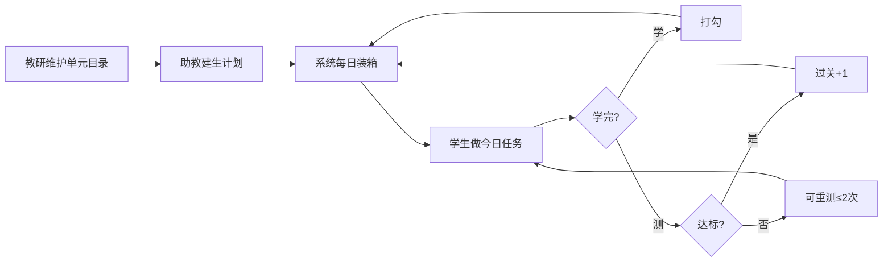

# 任务系统 · 产品总览（助教省时 · 流程清晰 · 监控到位 · 学生明确）

> **读者**：产品、助教、教研、开发  
> **状态**：讨论定稿  
> **更新**：2026-08-27  
> **技术实现细节**：见 [`task-system-spec.md`](task-system-spec.md)（Agent 实施说明）

---

## 1. 系统要解决什么

| 痛点 | 解法 |
|------|------|
| 助教每天要算「这个学生今天学啥、学多久」 | **只排一次总清单 + 设周中/周末时长**；系统每天自动装箱 |
| 学生不知道先练哪、容易乱点模块 | **今日任务首屏**；点进去只开当前单元 |
| 学了算不算完、测算不算过关说不清 | **打勾 = 学完；过关 = 阶段测达标**；分开统计 |
| 开课/换题/薄弱项要人工调 | **助教改清单顺序和内容**；系统不替人决定科目 |
| 老师看不到谁掉队 | **监控看板**：今日完成、积压、未过关、换题重学 |

**一句话**：助教定「学什么、测什么、顺序、能学多久」；系统定「今天放出哪几条」；学生只执行今日任务。

---

## 2. 三方分工（边界写死）

```
┌─────────────┐     排清单、调顺序、插阶段测、设时长      ┌─────────────┐
│   助教/教师  │ ──────────────────────────────────────► │  有序总清单  │
└─────────────┘     综合开课、薄弱、换题后重排            │  + 时间画像  │
                                                        └──────┬──────┘
                                                               │
                        按预算装箱、打勾、过关、提醒            ▼
                                                        ┌─────────────┐
┌─────────────┐     只看今日任务、点学/点测               │    系统     │
│    学生     │ ◄────────────────────────────────────── │  今日任务   │
└─────────────┘     不可见未释放清单                    └─────────────┘
```

| 谁 | 做什么 | 不做什么 |
|----|--------|----------|
| **助教** | 拖单元进清单、排序、插阶段测、设周中/周末分钟、开课周调整顺序 | 不必每天选「今天第几条」；不必手算分钟装几条 |
| **系统** | 生成今日任务、核销完成、进度 X/Y 与过关 A/B、插测建议、积压/异常标红 | 不自动改科目、不跳过清单顺序、不自动塞测试 |
| **学生** | 完成今日「学」「测」条目 | 不能改计划、不能看未放出单元 |

---

## 3. 助教省时：核心设计

### 3.1 只维护两样「慢变量」

| 变量 | 改的频率 | 内容 |
|------|----------|------|
| **时间画像**（每生一份） | 开学/换阶段改一次 | 周中每日 ___ 分钟；周末每日 ___ 分钟 |
| **有序总清单** | 开课/调进度时改 | 一串 `学` + `测` 条目，有顺序、无日期 |

**没有**「按日历每天拖任务」。

### 3.2 助教典型动线（单生约 3 分钟）

```text
1. 打开「任务计划」→ 选学生
2. 看监控条：今日是否完成 / 积压几条 / 有无换题重学 / 是否该插阶段测
3. 需要时：从左侧单元库拖入 或 调顺序 或 点「插入阶段测」
4. 扫一眼「本周预览」（系统按清单+时长模拟，心里有数即可）
5. 离开 —— 不用点「发布今日」
```

### 3.3 省时间的系统能力

| 能力 | 省什么 |
|------|--------|
| **自动每日装箱** | 不用每天排今日 |
| **插测建议条** | 「已连续 3 学未测」→ 一键插入阶段测，不用自己数 |
| **从某生复制** | 时间画像 / 清单结构复制给新班学生（进度清零） |
| **改清单明天生效** | 今天已发出的不乱；助教改完即可走，不用盯学生端 |
| **单元库已排标记** | 左侧看到哪些已进该生计划，避免重复拖 |
| **本周预览** | 不用心算「这清单要几周学完」 |

### 3.4 助教仍然必须人工的事（系统不替代）

- 根据 **开课、考试节点、学生强弱** 决定清单里有什么、什么顺序  
- **阶段测** 何时插（系统只建议，默认每学 2～3 单元提醒一次）  
- **换题后** 是否通知学生（系统自动变未完成 + 今日优先，助教可看影响人数）

---

## 4. 流程总览

### 4.1 生命周期（从建计划到学生学完）



### 4.2 每日时间线（上海时区）

| 时点 | 发生什么 |
|------|----------|
| **0:00 后首次访问** | 合并「昨天待生效」的清单/画像变更；生成或刷新今日任务 |
| **学生登录** | 看到今日任务（优先级见 §6） |
| **学习中** | 深链只开当前单元；完成自动打勾 |
| **助教改清单** | 写入待生效版本；**今日任务不变**；提示「计划明天生效」 |
| **单元换题** | 已完成→未完成；**立刻进今日并优先**（例外，不等明天） |
| **日末** | 未完成进入「昨日积压」，次日优先 |

### 4.3 学 vs 测（两套状态，学生一眼能懂）

| | 学习 `学` | 阶段测 `测` |
|--|-----------|-------------|
| **含义** | 把这个单元内容练完一遍 | 考一段范围是否达标 |
| **完成** | 打勾 ✓ | 交卷 |
| **过关** | — | 分数 ≥ 该生目标分对应达标线 |
| **进度** | 计划学习 **X/Y** | 计划过关 **A/B** |
| **节奏** | 助教排进清单 | 默认习惯：每学 **2～3** 单元插一测；系统可提醒 |

**重要**：学完打勾 **不等于** 过关。未过关时学习勾保留，可重测或助教再排补测。

---

## 5. 助教端：页面与操作

### 5.1 入口结构

```text
教师后台
└── 任务计划
      ├── 学生总览（监控列表）    ← 日常先看这里
      └── 学生计划页（单人工作台）
```

### 5.2 学生总览（监控列表）— 日常主界面

一屏看清全班，**减少点进每个学生的次数**。

| 列/指标 | 含义 | 标红条件（示例） |
|---------|------|------------------|
| 姓名 / 学号 | | |
| 今日任务 | 已完成 / 共几条 | 当日 20:00 仍 &lt;50% |
| 今日时长 | 已练 / 预算 | — |
| 积压 | 昨日及更早未完成条数 | ≥2 |
| 换题重学 | 待重学单元数 | ≥1 |
| 阶段测 | 最近未过关 | 同一测失败 ≥2 次 |
| 计划进度 | 各模块简写或折叠 | — |

操作：点行进入「学生计划页」；支持按「有积压 / 今日未完成」筛选。

### 5.3 学生计划页（单人工作台）

**双轨**：本页同时展示 **计划轨**（清单 X/Y、过关 A/B）与 **测试轨**（进度表 %/分）；两列并排，不合并。未纳入任务的科目在测试列灰显「暂未安排」（见 §8.4）。

```text
┌─ 监控摘要（计划轨）────────────────────────────────────┐
│ 今日 2/4 完成 · 积压 1 · 换题重学 1 · 建议插测：同义替换 U6–U8 │
└────────────────────────────────────────────────────┘

┌─ 模块进度（双列 · 见线框 §13.1）───────────────────────┐
│ 阅读同义   学 5/8 过关 1/3  │  测试 78% / 80%          │
│ 听力1000词 学 11/12 过关 5/6│  测试 85% / 80%  ✓       │
│ 基础语法   —                │  暂未安排（灰显）         │
└────────────────────────────────────────────────────┘

┌─ 时间画像 ─────────────────────────────────────────┐
│ 周中 [40] 分钟/天    周末 [90] 分钟/天              │
│ [从其他学生复制]     （修改明天生效）                 │
└────────────────────────────────────────────────────┘

┌─ 建议条（可忽略 7 天）──────────────────────────────┐
│ 同义替换已连续 3 学未插测  [插入阶段测 U4–U6] [忽略] │
└────────────────────────────────────────────────────┘

┌─ 单元库 ────────┬─ 有序清单（该生计划）──────────────┐
│ ▾ 阅读同义 23   │  阅读同义  学习 5/8 · 过关 1/3     │
│   U1 … U23      │  ─────────────────────────────    │
│ ▾ 听力1000词    │  1 学 · U6                        │
│ ▾ 口语·P1 …     │  2 学 · U7                        │
│                 │  3 测 · U4–U6 阶段测              │
│                 │  …                                │
└─────────────────┴───────────────────────────────────┘

┌─ 本周预览（只读，按待生效清单模拟）─────────────────┐
│ 周三约 40′ → 学U7、学U8  |  周六约 90′ → …         │
└────────────────────────────────────────────────────┘
```

**清单操作**

| 操作 | 生效 |
|------|------|
| 拖入 / 排序 / 移除 / 暂停 | **明天生效**（今日已放出不动） |
| 插入阶段测 | 同上（明天起按新清单释放）；若需「测」紧接刚学完的几单元，排在清单相应位置即可 |
| 改时间画像 | **明天生效** |

**今日锁定**：列表中标记「今日进行中」的条目灰显，不可删改顺序。

### 5.4 助教不用做的

- 不要每天勾选「发布今日任务」  
- 不要为每个学生选日期格子  
- 不要手动算「今天放 2 个还是 3 个单元」（除非要改周中/周末分钟）

---

## 6. 系统：今日任务怎么生成

### 6.1 输入

- 该生 **生效中** 的有序清单（跳过 `paused`；`removed` 不计入 Y）  
- 该生 **当日预算**：周六日 → `weekend_minutes`，否则 → `weekday_minutes`  
- 每条 `est_minutes`（来自单元目录，可被计划条目覆盖）

### 6.2 装箱顺序（优先级）

```text
1. 换题重学（强制放入，可超预算）
2. 昨日及更早未完成（carry-over）
3. 从清单队首取未学完、未在今日列表中的条目，直到预算 × 1.15 用尽
   （若队首单条已超预算，仍至少放 1 条）
```

`学` 与 `测` 都占分钟；**不因「该测了」自动把测提前**，顺序以清单为准。

### 6.3 默认参数

| 参数 | 默认值 |
|------|--------|
| 周中每日 | 40 分钟 |
| 周末每日 | 90 分钟 |
| 装箱容差 | +15% |
| 插测建议阈值 | 连续 3 个 `学` 未跟 `测` |
| 阶段测当日重测上限 | 2 次 |

---

## 7. 学生端：任务必须明确

### 7.1 首屏三块分区（计划 vs 测试，不可混用）

学生端自上而下 **三个独立区块**，标题与指标类型写死，避免把「5/8」当成「78%」。

```text
┌─ ① 今日任务（主路径 · 计划执行）────────────────────────┐
│  预计约 40 分钟                                         │
│  阅读同义替换     计划学习 5/8 · 计划过关 1/3           │
│    ✓ 学 · 单元6                         已完成           │
│    ○ 测 · 单元6–8 阶段测                 [去测试]       │
│    ○ 学 · 单元9                         [去学习]       │
│  听力1000词       计划学习 11/12 · 过关 5/6             │
│    ○ 学 · 第13组                         [去学习]       │
│  （可选）计划已更新，明天生效                             │
└─────────────────────────────────────────────────────────┘

┌─ ② 我的计划进度（只读 · 仅助教已排的科目）──────────────┐
│  阅读同义替换   学习 5/8 · 过关 1/3                     │
│  听力1000词     学习 11/12 · 过关 5/6                   │
│  （无计划科目的子块不出现）                               │
└─────────────────────────────────────────────────────────┘

┌─ ③ 测试与能力（原学习进度表 · 可折叠）──────────────────┐
│  阅读同义替换   测试 78% / 目标 80%    进行中             │
│  听力1000词     测试 85% / 目标 80%    已达标             │
│  基础语法       暂未安排              （灰显，不可点进）  │
│  口语练习       测试 6.0 / 目标 6.5    进行中             │
└─────────────────────────────────────────────────────────┘
```

| 区块 | 数据轨 | 学生主操作 |
|------|--------|------------|
| **① 今日任务** | 计划轨 | 点学/测，完成今日 |
| **② 我的计划进度** | 计划轨汇总 | 只看，不进自由练 |
| **③ 测试与能力** | 测试轨（原 `MODULES` 进度表） | 查看成绩；**已纳入计划**的科可点详情；**暂未安排**灰显 |

**禁止**：用一块进度条同时表示 X/Y 与测试 %；禁止用测试 % 自动打勾任务。

### 7.2 学生规则（简单可执行）

1. **只做今日列表里的「学」「测」**  
2. 点 **去学习** → 只打开该单元，做完自动打勾  
3. 点 **去测试** → 交卷后显示过关 / 未过关（可重测，有限次）  
4. **看不到** 清单里还没放出的单元  
5. 无任务时：未排 → **「今日暂无任务，请联系助教」**；全部暂停 → **「计划已暂停，请联系助教」**（D28）

### 7.3 状态文案（统一）

| 显示 | 含义 |
|------|------|
| 去学习 / 继续学习 | 单元未打完勾 |
| 已完成 | 学已打勾 |
| 去测试 / 继续测试 | 测未交卷或未完成 |
| 已过关 | 测达标 |
| 未过关 · 可重测 | 未达标且未超重测次数 |
| 内容已更新 | 换题后需用新题重学 |

### 7.4 与「自由练模块」的关系

- **MVP（D22）**：今日任务置顶，下方保留原模块入口；进入已纳入计划科目时弹窗「建议从今日任务进入」；自由练 **不** 打勾任务  
- **中期/V3**：有计划的学生可改为禁止自由入口，只从今日任务进  
- 学生 ③「查看详情」仅看历史成绩，**不**进模块学习  
- 避免：学生绕过任务导致进度对不上（MVP 靠提示；V3 收紧）

### 7.5 任务模式：题量与模块原生进度不一致

任务 **1 单元** 的题/组/句数，常与模块 **自由练** 里的导航粒度不同。这是正常现象，采用 **三层口径**，不强行合成一个数字：

| 层级 | 学生在哪看到 | 数什么 | 示例 |
|------|--------------|--------|------|
| **计划层** | ① 今日任务、② 计划进度 | 助教排的第几个任务单元 | 计划学习 **5/8** |
| **内容层** | 点「去学习」后的模块页（**任务模式**） | **本单元** `content_ref` 范围内 | **本单元 3/10 组**、**2/5 题** |
| **测试层** | ③ 测试与能力 | 模块测试成绩 | 测试 **78%** / 80% |

```text
① 今日任务
   阅读同义 · 计划 5/8              ← 计划层
   ○ 学 · 单元 6  [去学习]
          ↓
   [模块页 · 任务模式]
   今日任务 · 单元 6（入门基础篇）
   本单元：3/10 组已完成            ← 内容层（不是 45/225，也不是 5/8）

③ 测试与能力
   阅读同义 测试 78% / 80%          ← 测试层
```

**任务模式规则（已定）**

1. 深链带 `task_id` / `plan_item_id` 时，模块 **只开当前单元**，隐藏全库目录  
2. 页内进度固定文案 **「本单元」**，只显示 `content_ref` 内的 n/m  
3. 打勾以任务完成为准；**不用**模块全库 % 自动打勾  
4. 单元做完后 **可** 回写模块内局部完成态（方便日后自由练不重复），但 **不** 改变计划 X/Y 的计算方式  

**典型不一致（产品已知，按任务模式处理）**

| 模块 | 自由练常见显示 | 任务 1 单元 | 任务模式显示 |
|------|----------------|-------------|--------------|
| 阅读同义 | 225 小组 / 23 大组 | 1 大组（多数 10 小组；U23=5） | **n/m 组**（动态） |
| 听力同义 | 12 组 × 10 题 | 5 题 | **2/5 题**（需改模块 UI） |
| 长难句 | 60 句 | 5 句 | **2/5 句** |
| 口语 P1 | 235 题 | 10 题 | **7/10 题** |
| 听力1000词 | 20 词/组 | 20 词/组 | 已对齐 |

实现细节见 [`task-system-spec.md`](task-system-spec.md) §10.1。

---

## 8. 双轨进度与进度表对齐

任务系统的 **学习单元** 与主站 **学习进度表**（`MODULES`）不是同一套「单位」，也 **不合并成一个百分比**。采用 **双轨 + 映射 + 界面三块分区**（见 §7.1）。  
模块 **原生题量/组量** 与任务单元也可能不同，任务模式下只展示 **本单元** 进度（见 §7.5）。

### 8.1 双轨定义

| 轨道 | 名称 | 回答的问题 | 典型指标 | 数据来源 |
|------|------|------------|----------|----------|
| **计划轨** | 任务 / 计划进度 | 助教安排的学完了没有、测过关了没有 | 学习 **X/Y**、过关 **A/B** | 计划清单 + 单元打勾/阶段测 |
| **测试轨** | 测试与能力 | 考得怎么样、离目标分还差多少 | 测试 **%**、**个**、**分** | 现有 `test_records` + `MODULES.targets` |

**铁律**：

- 计划打勾 **≠** 测试达标；测试高分 **≠** 计划单元自动完成。  
- **不**用计划 X/Y 回写进度表 `bestScore`；**不**用 `bestScore` 自动打勾任务。

### 8.2 `parent_module` 映射

任务单元挂在 **任务 module_type**（口语可分子块）；进度表一行对应 **`MODULES.id`**（`parent_module`）。

| 任务 `module_type` | `parent_module`（进度表） | 进度表展示名 |
|--------------------|---------------------------|--------------|
| `reading_synonym` | `reading_synonym` | 阅读同义替换 |
| `dictation` | `dictation` | 听力1000词 |
| `listening_basic` | `listening_basic` | 听力基础词汇 |
| `listening_synonym` | `listening_synonym` | 听力同义替换 |
| `sentence` | `sentence` | 长难句分析 |
| `writing_phrase` | `writing_phrase` | 写作词伙 |
| `writing_translate` | `writing_translate` | 写作句子翻译 |
| `listening_p4_speed` | `listening_p4_speed` | 听力P4跟读倍速 |
| `speaking_complex` | `speaking` | 口语练习（汇总） |
| `speaking_p1` | `speaking` | 同上 |
| `speaking_p2_material` | `speaking` | 同上 |
| `speaking_p2_apply` | `speaking` | 同上 |

**口语**：任务侧按 **4 个子块** 排单元、显示 X/Y；进度表仍 **1 行** `speaking`（单位：分）。班级总览「口 12/60」= 各子块 **计划学** 条数合计，**不是** 口语分数。

**仅进度表、暂无任务单元**的科目（如小初单词、语法、阅读 P1…）：只在 **测试轨** 出现；计划轨无 X/Y，见 §8.4。

### 8.3 同一科目在两轨上怎么显示

以「阅读同义替换」为例：

```text
计划轨（任务）          测试轨（进度表）
学习 5/8 · 过关 1/3     测试 78% / 目标 80%
```

助教 **学生计划页** 模块摘要建议两列并排：

```text
模块（计划）              测试进度（只读）
阅读同义  学5/8 过关1/3    78% / 80%
口语·P1   学8/24          —
口语（汇总） —              6.0 / 6.5
```

### 8.4 进度表：「未纳入任务」的科目

判定：该生计划清单中，此 `parent_module` 下 **无任何** `study` / `test` 条目（或任务系统标记该科 `not_in_plan`）。

| 端 | 展示 | 交互 |
|----|------|------|
| **学生 · ③ 测试与能力** | 行 **灰显**；副文案 **「暂未安排」** | **不可** 从进度表进入学习（避免绕过今日任务）；仍可看历史测试分（若有） |
| **学生 · ①②** | 不出现该科 | — |
| **助教 · 学习进度 Tab** | 灰显 +「暂未安排」标签 | 可查看历史数据；引导去「任务计划」拖单元 |
| **助教 · 班级总览** | 计划进度(简) **不** 显示该科 | 测试轨不在此列展示 |

**已纳入任务** 后：进度表该行恢复正常色；计划轨出现 X/Y；学生可从今日任务进入；进度表该行可点 **查看详情**（仅历史成绩，**不**进模块学习）。

### 8.5 与阶段测、模块总测的关系

| 类型 | 归属轨道 | 说明 |
|------|----------|------|
| 计划内 **阶段测**（清单里的 `测`） | 计划轨过关 **A/B** | 覆盖 2～3 单元；交卷写库见下行 |
| 计划内阶段测交卷 | 计划过关 + 审计行 | 写 `test_records(record_kind=stage_test)`；**不**抬高测试轨 % |
| 进度表 **模块测试 / 随机测** | 测试轨 **bestScore** | 只聚合非 stage 记录 |

---

## 8.6 P0 / P1 定稿摘要

### P0（2026-08-27）

| ID | 决定 |
|----|------|
| D20 | `done_fail` **不算**今日完成；测挂 +1 |
| D21 | 阶段测写 `test_records` 但标记 stage；测试轨排除 |
| D22 | MVP 自由练可进 + 弹窗；**不**打勾任务 |
| D23 | 积压 = 曾进 daily 且未完成；未装箱队首不算 |
| D24 | 队首测挂死 **不**自动跳过；助教移队尾/插复习/重置重测 |
| D25 | 任务模式 **禁**下一课（含 P4） |

### P1（2026-08-28）

| ID | 决定 |
|----|------|
| D26 | 清单 **禁止** 重复 `unit_id`；已排灰显 |
| D27 | `scope_done` **服务端**为准；模块上报增量 |
| D28 | 全部 paused → ⚪ **「计划已暂停」**（区别「未排计划」） |
| D29 | MVP **不做**紧急重算今日（维持 D13） |
| D30 | ③ 详情 **只读**；禁从详情进学习 |

实现细节见 [`task-system-spec.md`](task-system-spec.md) D20–D30。

---

## 9. 监控到位：看什么、何时介入

### 9.1 三级监控

| 级别 | 谁看 | 看什么 |
|------|------|--------|
| **班级总览** | 助教每日扫一眼 | 今日完成率、积压人数、换题重学人数（**仅计划轨**） |
| **学生计划页** | 调单个学生 | 清单进度、**计划+测试双列**、建议插测、本周预览 |
| **原有教师进度（测试轨）** | 深度分析 | 模块测试最高分、练习时长；**暂未安排**科目灰显 |

### 9.2 建议介入规则（看板标红）

| 信号 | 建议动作 |
|------|----------|
| 连续 2 天今日完成 &lt;50% | 谈话或降清单量 / 调低周中分钟 |
| 积压 ≥3 条 | 减新单元或提高周末分钟；清队首卡点 |
| 阶段测同一范围失败 2 次 / 队首测挂死 | **不自动跳过**；助教移队尾 / 插复习 / 重置重测 |
| 换题重学未完成 | 系统已今日优先；助教确认学生已看到 |
| 7 天无今日任务完成记录 | 检查是否未排清单或学生未登录 |

### 9.3 进度口径（避免误解）

- **计划学习 X/Y**、**计划过关 A/B**：仅 **计划轨**；Y/B = 助教排的条数，不是全库单元数  
- **测试 % / 分 / 个**：仅 **测试轨**；来自 `MODULES` + `test_records`（**排除** `stage_test`）  
- 班级总览「计划进度(简)」**只显示计划轨**，不显示测试 %  
- 两轨通过 `parent_module` 关联同一科目，**数字不混用、不换算**

---

## 10. 单元目录（已定科目摘要）

助教从 **单元库** 拖入清单；每格 = 一个可独立学习/可测的范围。

| 模块 | 1 单元 = | 约数量 |
|------|----------|--------|
| 阅读同义替换 | 1 个大组（GROUP_SETS） | 23 |
| 听力1000词 | 1 组（20 词，四阶段） | ~50 |
| 听力基础词汇 | 1 组（50 词） | 按组数 |
| 听力同义替换 | 5 题 | ~24 |
| 长难句 | 5 句 | 12 |
| 写作词伙 | 1 个分类（含基础必背） | 14 |
| 写作句子翻译 | ≤10 句整类；更大类每 5 句 | ~23 |
| 听力 P4 跟读 | 1 篇（≥70% 完成） | 1+ |
| 口语·复合句 | 1 句型/词组（拼装+跟读+脱口而出） | 17 |
| 口语·P1 | 跨类连续每 10 题 | ~24 |
| 口语·P2 素材 | 1 个素材 | 8 |
| 口语·P2 套题 | 5 题 | 11 |
| 作文批改 | **不纳入** | — |

暂不规划：口语 P3、单词语法未上线模块等。

---

## 11. 换题与异常（流程要明确）

| 事件 | 学生侧 | 助教侧 | 生效 |
|------|--------|--------|------|
| 助教改清单顺序 | 今日不变；提示明天生效 | 改完即走 | 明天 |
| 助教改周中/周末分钟 | 今日预算不变 | 改完即走 | 明天 |
| **单元换题** | 该单元变未完成；**今日列表顶部**「内容已更新」 | 看板显示影响人数 | **立刻** |
| 昨日未完成 | 今日列表靠前 | 积压 +1 | 今日 |
| 阶段测未过关 | 可重测（≤2） | 未过关标记 | 当日 |

换题规则：**unit_id 不变**；老题归档；学生只练新题；**阶段测过关不因换题自动取消**。

---

## 12. 错题本（与任务系统关系 · 后续）

错题本 **独立** 于今日任务，不替代助教清单；可用于监控与复习任务。

- 听写两科：沿用 `wrong_words`  
- 其他科：规划 `wrong_items` 通用表（见专项讨论）  
- 助教可选插「复习错题」类任务（后期）  
- 错题 **不计入** 计划学习 X/Y，除非单独排成 `学` 条目  

**首版任务系统可不阻塞于错题本**；监控可先展示听写「待复习错词 N」。

---

## 13. 实施分期（与省助教目标对齐）

| 阶段 | 交付 | 助教能做什么 |
|------|------|----------------|
| **MVP** | 2 科试点（阅读同义 + 听力1000词）+ 总览监控 + 单人计划页 + 学生今日任务 | 排清单、设时长、看今日完成与积压 |
| **V2** | 全科单元库 + 插测建议 + 本周预览 + 换题重学 | 少进单人页，总览即可筛风险学生 |
| **V3** | 清单复制 + 错题复习任务 + 弱化自由入口 | 开班复制计划，单人维护时间更短 |

---

## 14. 验收标准（产品级）

**双轨进度**

- [ ] 学生端三块分区标题与指标类型正确（§7.1）  
- [ ] 未纳入任务的进度表科目灰显 +「暂未安排」，不可从进度表进学习  
- [ ] 同一科目计划 X/Y 与测试 % 并列展示、不合并  
- [ ] 口语子块计划进度可汇总；进度表仍 1 行 speaking  

**助教省时**

- [ ] 新学生：设画像 + 拖入 ≥5 条清单 &lt;5 分钟  
- [ ] 日常：不调清单时 **零操作**，学生仍有今日任务  
- [ ] 调清单后 **无需** 手动同步今日  

**流程明确**

- [ ] 学/测/打勾/过关文案全场一致  
- [ ] 改清单明天生效、换题立刻优先，文档与界面一致  

**监控到位**

- [ ] 总览可筛：今日未完成、积压、换题重学  
- [ ] 单人页可见计划 X/Y、过关 A/B、本周预览  

**学生明确**

- [ ] 登录首屏即今日任务 + 预计分钟  
- [ ] 点学/测只开当前单元；完成后列表更新  
- [ ] 无计划时有明确提示  
- [ ] 任务模式模块页显示「本单元 n/m」，不显示全库题量；与计划 5/8、测试 78% 三者不混在同一进度条  
- [ ] `done_fail` 不算今日完成；阶段测不抬高测试轨 %；任务模式禁下一课；积压/队首挂死按 D23/D24  

---

## 15. 相关文档

| 文档 | 用途 |
|------|------|
| [`task-system-spec.md`](task-system-spec.md) | 表结构、API、装箱算法、**双轨/`parent_module`/灰显**、**任务模式 scope**、深链、Agent 验收用例 |
| [`task-system-teacher-dashboard-wireframe.md`](task-system-teacher-dashboard-wireframe.md) | **助教班级总览** 线框、列定义、标红/标黄规则 |
| 本文 | 产品流程、助教/学生/监控 |

---

## 16. 一句话

**助教只维护「清单 + 时长」，系统每天帮学生装好今日「学/测」；计划进度、本单元进度、测试成绩三层分开显示；看板告诉助教谁该管，学生打开就知道今天做哪几条。**
